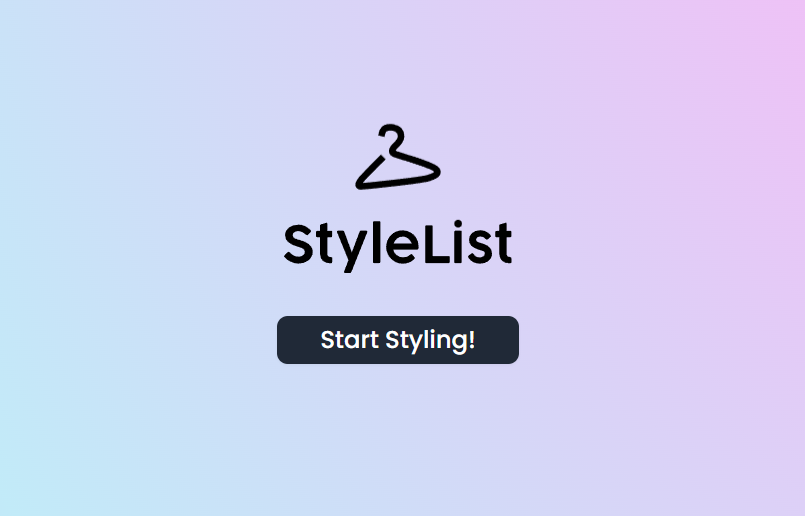

# StyleList - AI Fashion Stylist

<div align="center">
  <p align="center">
    <a href="https://www.figma.com/design/eJiELUVBnuWqzLbn5G4dFH/StyleList?node-id=68-8361&t=GbFiUd5nduyQNukT-1">
      
    </a>
    <a href="https://drive.google.com/drive/folders/138ZAhjLBEtnAIZFxL4i5bubR_Wdt_rYO?usp=drive_link">
      
    </a>
  </p>

  <p align="center">
    
    
    
    
  </p>

  <p align="center">
    
    
    
  </p>

  <br />
  
  
  
  <p align="center">
    <strong>AI-Powered Fashion Styling Application</strong>
  </p>
</div>

---

## 📋 Project Resources

📐 **Slides**: [Figma Design](https://www.figma.com/design/eJiELUVBnuWqzLbn5G4dFH/StyleList?node-id=68-8361&t=GbFiUd5nduyQNukT-1)

📁 **Project Assets**: [Google Drive Folder](https://drive.google.com/drive/folders/138ZAhjLBEtnAIZFxL4i5bubR_Wdt_rYO?usp=drive_link)

---

## 📖 Table of Contents

- [About](#about)
- [Features](#features)
- [Technology Stack](#technology-stack)
- [Getting Started](#getting-started)
- [Usage](#usage)
- [API Endpoints](#api-endpoints)
- [Project Structure](#project-structure)
- [Configuration](#configuration)
- [Development](#development)
- [Deployment](#deployment)
- [Contributing](#contributing)
- [License](#license)

---

## 🎯 About

An AI-powered fashion styling application that provides personalized clothing recommendations using computer vision and natural language processing. Users can upload photos and receive styling advice focused on tops and bottoms, with integrated product search capabilities.

## ✨ Features

### Core Functionality
- **AI Fashion Stylist**: Conversational interface powered by Gemini 2.5 Flash via OpenRouter
- **Auto-Style Mode**: ✨ **NEW** - Automatically generates moodboards from styling advice with gender-aware product searches
- **Image Analysis**: Upload photos to receive personalized styling recommendations
- **Product Search**: Integration with Amazon product catalog via RapidAPI
- **Moodboard Creation**: Visual collections of selected clothing items with virtual try-ons
- **Multi-Modal Chat**: Support for both text and image inputs in conversations

### Technical Capabilities
- **Streaming AI Responses**: Real-time conversation with markdown formatting
- **Image Validation**: AI-powered photo quality assessment
- **Persistent State**: Cross-session data storage using Zustand
- **Responsive Design**: Mobile and desktop optimized interface

## 🛠️ Technology Stack

### Frontend
- **Next.js 15** with App Router and TypeScript
- **React 18** with server and client components
- **Tailwind CSS** for styling and responsive design
- **Zustand** for state management with persistence
- **React Markdown** for formatted AI responses
- **Lucide Icons** for UI iconography

### Backend & APIs
- **Vercel AI SDK** for streaming AI interactions
- **Amazon Product API** via RapidAPI for product data
- **Custom API routes** for chat, image validation, and moodboard generation
- **Server actions** for form handling and data processing

### AI Integration
- **Gemini 2.5 Flash** model via OpenRouter for fashion expertise
- **Vision capabilities** for image analysis and styling recommendations
- **Tool calling** for product search integration
- **Custom system prompts** optimized for fashion styling

## 🚀 Getting Started

### Prerequisites
- Node.js 18.0 or later
- npm or yarn package manager
- RapidAPI account for Amazon product access

### Installation

1. Clone the repository:
```bash
git clone <repository-url>
cd open-ai-stylist
```

2. Install dependencies:
```bash
npm install
```

3. Configure environment variables:
Create a `.env.local` file with the following:
```env
LLM_CLIENT_ENDPOINT=your_llm_client_endpoint_here
LLM_CLIENT_MODAL=your_llm_client_model_here
LLM_CLIENT_API_KEY=your_llm_client_api_key_here
FASHN_API_KEY=your_fashn_api_key_here

# Real-Time Amazon Data API Credentials
RAPIDAPI_KEY=your_rapidapi_key_here
RAPIDAPI_HOST=real-time-amazon-data.p.rapidapi.com
```

4. Start the development server:
```bash
npm run dev
```

5. Open [http://localhost:3000](http://localhost:3000) in your browser

## 💻 Usage

### Initial Setup
1. Navigate to the onboarding page to upload approved model photos
2. Photos are validated using AI for styling suitability
3. Approved photos are stored for use in styling conversations

### Styling Conversations
1. Start a new chat session
2. Upload a photo or describe your styling needs
3. Receive personalized recommendations for tops and bottoms
4. Browse suggested products with real-time Amazon pricing
5. Select items to create moodboards

### Moodboard Management
1. Select products during conversations
2. Create themed collections with AI-generated titles
3. View products in responsive grid layouts
4. Access direct purchase links for selected items

### Auto-Style Mode ✨
The Auto-Style feature automatically creates moodboards from styling conversations:

1. **Enable Auto-Style**: Click the sparkles ✨ button in the chat input area
2. **Get Styling Advice**: Have a normal conversation with the AI stylist
3. **Automatic Processing**: When the AI provides styling advice, Auto-Style:
   - Analyzes the advice to detect gender context (men/women/unisex)
   - Extracts key clothing items mentioned
   - Performs gender-aware product searches
   - Generates virtual try-ons with your model photos
   - Creates a complete moodboard automatically
4. **Instant Results**: Receive notifications when your auto-generated moodboards are ready

#### Auto-Style Features:
- **Gender-Aware Search**: Automatically detects and uses appropriate gender-specific search terms
- **Smart Product Selection**: AI chooses the most relevant items from styling advice
- **Creative Moodboard Titles**: AI generates compelling, context-appropriate board names
- **Virtual Try-Ons**: Automatically applies your model photos to products
- **Background Processing**: Non-blocking operation that doesn't interrupt conversations
- **Zero Manual Effort**: Complete styling boards created without user intervention

## API Endpoints

### `/api/chat`
Main chat interface supporting both text and image inputs
- **Method**: POST
- **Input**: Message array with text/image content
- **Output**: Streaming AI responses with tool calls
- **Features**: Context awareness, product search integration

### `/api/validate-image`
Image quality validation for styling purposes
- **Method**: POST  
- **Input**: Base64 encoded image data
- **Output**: Validation result with feedback
- **AI Model**: Vision-enabled analysis

### `/api/generate-moodboard`
Moodboard creation and product categorization
- **Method**: POST
- **Input**: Selected products and user preferences
- **Output**: Categorized collections with metadata

### `/api/proactive-style-generator`
✨ **NEW** - Auto-Style background processing endpoint
- **Method**: POST
- **Input**: AI styling advice text
- **Processing**: Gender detection, product search, virtual try-ons
- **Output**: Complete moodboards with try-on images
- **Features**: Isolated infrastructure, non-blocking operation

### `/api/notify-try-on-complete`
Notification system for completed moodboard processing
- **Method**: GET/POST
- **Function**: Polling endpoint for auto-generated moodboard completion
- **Integration**: Works with both manual and auto-generated moodboards

## Project Structure

```
src/
├── app/                    # Next.js App Router pages
│   ├── api/               # API route handlers
│   ├── chat/              # Chat interface pages
│   ├── gallery/           # Moodboard gallery
│   ├── onboarding/        # Photo upload flow
│   └── store/             # Zustand state management
├── components/            # Reusable React components
│   ├── aceternity/        # Third-party UI components
│   └── ui/                # Custom UI components
└── lib/                   # Utility functions and services
```

## Configuration

### Environment Variables
- `LLM_CLIENT_ENDPOINT`: API endpoint for llm client

      - For OpenRouter, use https://openrouter.ai/api/v1
      - For Groq, use https://api.groq.com/openai/v1

- `LLM_CLIENT_MODAL`: Open IA Modal

      - For OpenRouter, use 'google/gemini-2.5-flash'
      - For Groq, use 'meta-llama/llama-4-scout-17b-16e-instruct'

- `LLM_CLIENT_API_KEY`: Authentication key for LLM Client API
- `FASHN_API_KEY`: Authentication key for Fashion API services
- `RAPIDAPI_KEY`: Authentication key for Amazon product API
- `RAPIDAPI_HOST`: API host endpoint for product search

### Model Configuration
The application can use multiple modal via OpenRouter, Groq, etc...

It recommands to use Gemini 2.5 Flash via OpenRouter with custom system prompts optimized for:
- Fashion styling expertise
- Focus on tops and bottoms (excluding accessories)
- Professional styling advice
- Product recommendation workflow

## Development

### Code Quality
- TypeScript for type safety
- ESLint configuration for code standards
- Component-based architecture
- Error boundary implementation

### State Management
- Zustand store with persistence
- Modular state slices for different features
- Cross-component state sharing
- Local storage integration

### Styling System
- Tailwind CSS utility classes
- Custom component styling
- Responsive design patterns
- Dark/light theme support

## Deployment

### Vercel (Recommended)
The application is optimized for Vercel deployment:

```bash
vercel --prod
```

### Environment Setup
Ensure all environment variables are configured in your deployment platform:
- `RAPIDAPI_KEY`
- `RAPIDAPI_HOST`

## License

MIT License - see LICENSE file for details

## 🤝 Contributing

We welcome contributions! Please follow these guidelines:

### How to Contribute

1. **Fork** the repository
2. **Create** a feature branch (`git checkout -b feature/AmazingFeature`)
3. **Commit** your changes (`git commit -m 'Add some AmazingFeature'`)
4. **Push** to the branch (`git push origin feature/AmazingFeature`)
5. **Open** a Pull Request

### Development Guidelines

- Follow TypeScript best practices
- Ensure code passes ESLint checks
- Add tests for new features
- Update documentation as needed
- Follow the existing code style

### Issues

Found a bug or have a feature request? Please [open an issue](https://github.com/your-username/open-ai-stylist/issues/new) with:

- Clear description of the problem/feature
- Steps to reproduce (for bugs)
- Expected behavior
- Screenshots (if applicable)

---

## 📄 License

This project is licensed under the MIT License - see the [LICENSE](LICENSE) file for details.

---

<div align="center">
  <p>Made with ❤️ by the StyleList Team</p>
  <p>
    <strong>Star ⭐ this repository if you find it helpful!</strong>
  </p>
</div>
